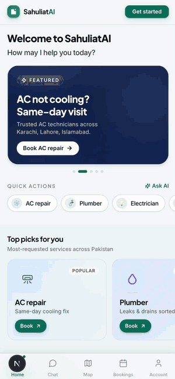
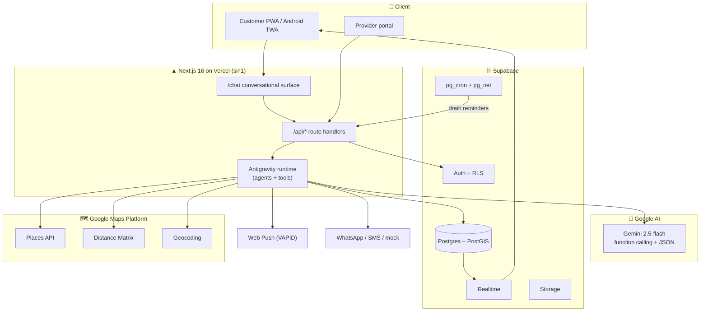
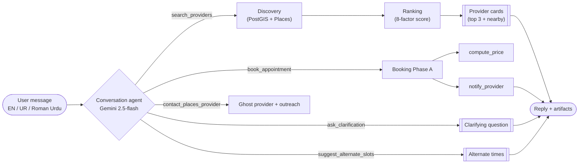
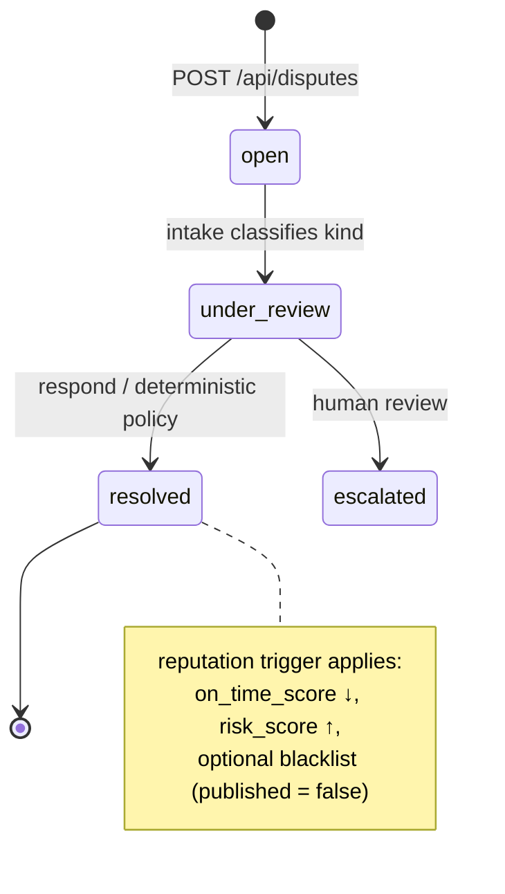
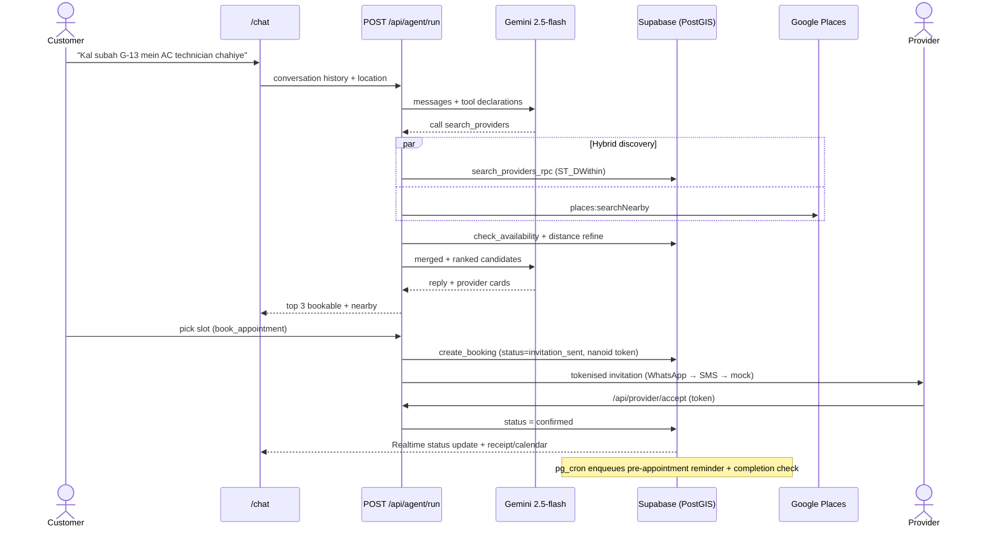
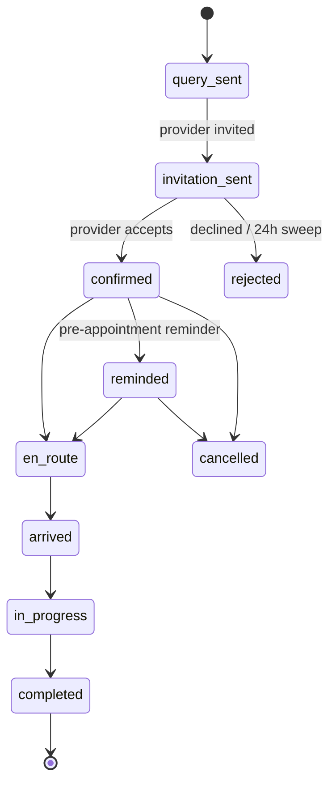
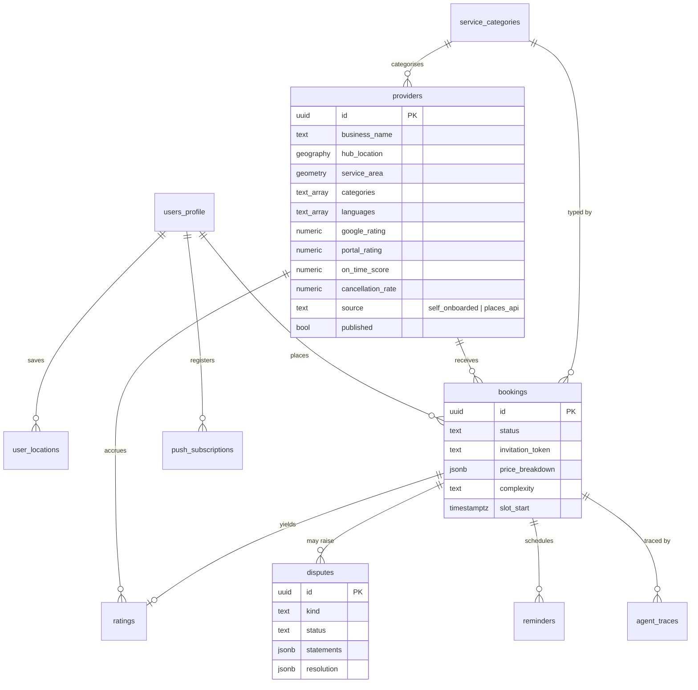
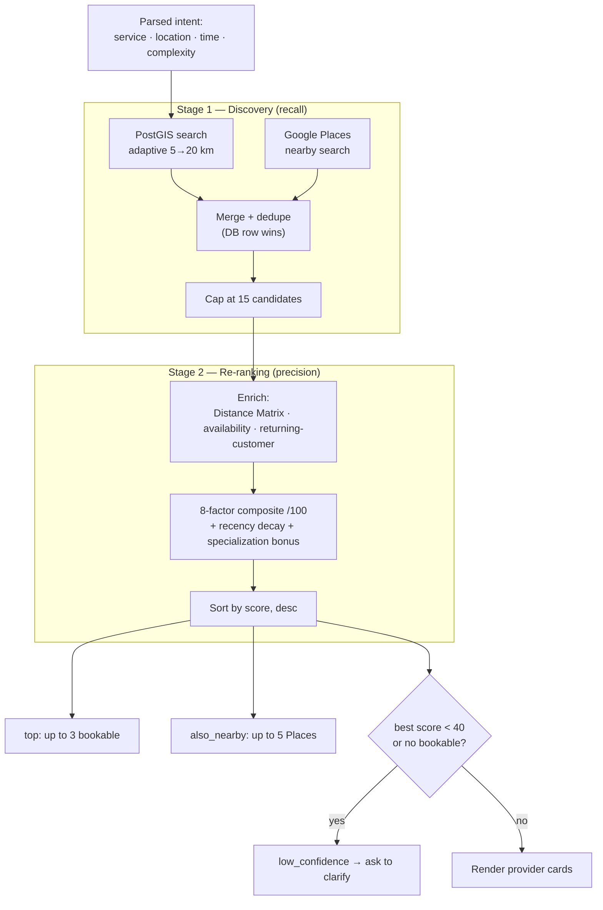

# SahuliatAI — Agentic AI for the Informal Economy

> A multilingual, agent-driven assistant that helps anyone in Pakistan **find, vet, book, and follow up with** informal-economy service providers — plumbers, AC technicians, electricians, tutors, beauticians, mechanics, cooks, masons, painters, cleaners, and more.

*Hackathon submission for the **Google Antigravity / Gemini Hackathon — Challenge 2 (Informal Economy)**, 2026.*

---

## 🎥 Demo

<div align="center">

<table>
  <tr>
    <td align="center" width="50%">First 30 seconds (real-time)</td>
    <td align="center" width="50%">Full journey (sped-up overview)</td>
  </tr>
  <tr>
    <td align="center" valign="top"><a href="./Demo_hackathon.mp4"></a></td>
    <td align="center" valign="top"><a href="./Demo_hackathon.mp4"></a></td>
  </tr>
</table>

</div>

▶️ **[Watch the full demo with audio — `Demo_hackathon.mp4`](./Demo_hackathon.mp4)** (~8 min)

---

## Table of Contents

1. [Overview](#1-overview)
2. [Key Features](#2-key-features)
3. [Technology Stack](#3-technology-stack)
4. [System Architecture](#4-system-architecture)
5. [Agents Developed](#5-agents-developed)
6. [The Antigravity Workflow & Event Model](#6-the-antigravity-workflow--event-model)
7. [End-to-End Booking Flow](#7-end-to-end-booking-flow)
8. [Provider Data Model](#8-provider-data-model)
9. [Matching & Ranking Algorithm](#9-matching--ranking-algorithm)
10. [APIs, Tools & Integrations](#10-apis-tools--integrations)
11. [Cost & Latency Analysis](#11-cost--latency-analysis)
12. [Baseline Comparison](#12-baseline-comparison)
13. [Security & Privacy](#13-security--privacy)
14. [Assumptions](#14-assumptions)
15. [Limitations & Roadmap](#15-limitations--roadmap)
16. [Running Locally](#16-running-locally)
17. [Repository Layout](#17-repository-layout)

---

## 1. Overview

### The problem

Pakistan's informal economy — the plumbers, electricians, tutors, and tradespeople who keep households running — has no trustworthy digital front door. Hiring one today means searching Google, calling a string of unverified numbers, haggling with no pricing reference, and having **zero recourse** when a worker no-shows, overcharges, or does poor work. The friction is worst for the people least served by English-first marketplace apps: customers who think and type in Urdu or Roman Urdu.

### The solution

SahuliatAI replaces that experience with a single **conversational interface** that a customer can talk to in English, Urdu, or Roman Urdu — with no language picker and no rigid forms. Behind the chat surface sits a coordinated team of **purpose-built AI agents** that together carry a request from a vague sentence ("AC theek karwana hai kal subah") all the way to a confirmed, priced, calendar-ready booking — typically in **under two minutes**.

The product is delivered as an installable **mobile Progressive Web App (PWA)**, also packaged as an Android **APK** (Trusted Web Activity), so it works on the low-end devices that dominate the target market.

### What makes it *agentic*

SahuliatAI is not a chatbot with a database query bolted on. Each stage of the journey is owned by a **discrete agent with typed inputs and outputs**:

- A **conversation agent** interprets the customer and decides, turn by turn, which tools to call.
- A **discovery agent** sources candidates from both a curated provider database and the live Google Places API.
- A **ranking agent** scores every candidate on an explainable **8-factor, 100-point model**.
- A **booking agent** runs a two-phase, token-secured provider invitation flow.
- A **follow-up agent** drives reminders, live status updates, and post-service rating prompts.
- A **dispute-resolution agent** applies a deterministic refund/compensation policy when a job goes wrong.

Every agent step writes a **structured trace row**, so every recommendation, price, and decision is fully auditable after the fact — a recommendation can always be explained, never just asserted.

---

## 2. Key Features

| Capability | Description |
|------------|-------------|
| **Multilingual conversational booking** | Natural-language chat that absorbs English, Urdu, and Roman Urdu with no language selector. |
| **Hybrid provider discovery** | Blends a self-onboarded, bookable provider database with live Google Places results in one ranked stream. |
| **Explainable 8-factor matching** | Every recommendation carries a per-factor score breakdown — distance, rating, reliability, price fit, language, and more. |
| **Two-phase booking** | The customer picks a slot; the provider confirms via a secure, expiring invitation link — no provider account required to accept. |
| **Dynamic pricing** | `compute_price` builds a transparent breakdown from visit fee, labour, distance, urgency, complexity, surge, and loyalty. |
| **Live service timeline** | Realtime booking status (`en route → arrived → in progress → completed`) pushed to the customer via Supabase Realtime + Web Push. |
| **Automated follow-up** | Pre-appointment reminders and post-service rating prompts scheduled with Supabase `pg_cron`. |
| **Dispute resolution** | A dedicated agent classifies the issue and applies a deterministic refund/compensation/blacklist policy in seconds. |
| **Dual ratings** | Providers carry both a **Google Places rating** and a **portal rating** built from SahuliatAI's own verified post-booking reviews. |
| **Full agent traceability** | Every workflow run is recorded step-by-step in `agent_traces` and exposed through a live trace viewer at `/trace/[runId]`. |

---

## 3. Technology Stack

| Layer | Technology |
|-------|-----------|
| **Framework** | Next.js 16 (App Router, Turbopack), React 19, TypeScript 5 |
| **Styling / UI** | Tailwind CSS, CSS-variable theming (light/dark), Lucide / Tabler icons, Noto Nastaliq Urdu for RTL |
| **AI / LLM** | Google **Gemini 2.5-flash** — native function calling + structured (JSON) output |
| **Database** | Supabase **PostgreSQL** with **PostGIS** (geospatial), `pg_cron` (scheduling), `pg_net` (outbound HTTP), `btree_gist` (no-overlap constraint) |
| **Auth** | Supabase Auth (email + password) with row-level security on every table |
| **Realtime** | Supabase Realtime channels (live booking inbox + status) |
| **Storage** | Supabase Storage (provider/evidence photos, signed URLs) |
| **Maps & location** | Google **Places**, **Distance Matrix**, **Geocoding** APIs; Google **Maps JS** via `@vis.gl/react-google-maps` |
| **Notifications** | Web Push (VAPID); WhatsApp Business / SMS (mockable, Twilio/Meta-ready) |
| **Validation** | Zod schemas shared between agents, tools, and API routes |
| **i18n** | `next-intl` — English (`en`), Urdu (`ur`, RTL), Roman Urdu (`ur-Latn`) |
| **Hosting** | Vercel (region `sin1`); PWA + Android APK via PWABuilder TWA wrapper |

> **Note:** client state is intentionally lightweight — local React state plus Supabase Realtime channels and `localStorage` for chat history. (`zustand` / `@tanstack/react-query` / `framer-motion` appear in `package.json` but are not load-bearing in the current build.)

---

## 4. System Architecture

SahuliatAI follows a **server-orchestrated agent architecture**. The browser is a thin client; all reasoning, tool execution, and data access happen server-side inside Next.js route handlers — keeping API keys, provider PII, and business logic off the device.



### Why "Antigravity"?

The name carries two meanings in this project:

1. **The IDE.** The agents were designed, instrumented, and traced inside Google Antigravity. Every workflow step writes a structured trace row, mirroring the agent-tracing model the IDE encourages.
2. **The architectural philosophy.** Discrete agents with typed I/O, **deterministic plans** for production-critical paths, and **LLM-mediated reasoning** reserved for the places that genuinely need judgment (intent parsing, conversation, summarization). This keeps the system predictable and debuggable while still feeling intelligent.

> Under the hood, the LLM layer (`lib/antigravity/llm.ts`) calls Gemini directly via the `@google/generative-ai` SDK, and falls back to deterministic, schema-shaped mocks when no API key is present — so the whole app stays demonstrable offline.

---

## 5. Agents Developed

All agents live in `product/lib/antigravity/agents/`, expose typed inputs/outputs, and persist a structured trace row per step.

| Agent | File | Responsibility |
|-------|------|----------------|
| **Conversation** | `conversation.ts` | Powers the `/chat` surface — a single Gemini agent that holds conversation history, decides turn-by-turn which tools to call, and returns a natural-language reply plus UI artifacts. Includes a **hallucination guard** that rewrites any reply claiming an action ("booked", "sent") that wasn't actually executed. This is the primary runtime for interactive use. |
| **Planner** | `planner.ts` | Maps an incoming `AppEvent` to a **deterministic plan** — an ordered list of agent calls. Uses no LLM; the plan *is* the contract, which keeps production paths reproducible. |
| **Intent Parser** | `intent-parser.ts` | Extracts the structured **intent** (service category, location, time window, complexity) from free-form multilingual text. LLM-primary via Gemini structured output, with a Roman-Urdu / Urdu / English keyword and lookup-table **fallback**. |
| **Discovery** | `discovery.ts` | Sources candidates from the seeded `providers` table (PostGIS proximity search with an **adaptive 5 → 20 km radius**) and the **live Google Places** Nearby Search. Deduplicates the merged set (database row wins) and caps it at 15 candidates. |
| **Ranking** | `ranking.ts` | Scores every candidate on the **8-factor, 100-point composite model** with rating-recency decay and a complexity-aware specialization bonus. Emits a per-pick factor breakdown into the trace. |
| **Booking** | `booking.ts` | Runs **Phase A** of the two-phase booking: creates the booking row, sends the provider a **tokenised invitation** via `notify_provider`, and generates receipt + calendar artifacts. Phase B (acceptance) is handled by `/api/provider/accept`. |
| **Follow-up** | `followup.ts` | Drives the post-booking lifecycle — `enqueue_pre_appointment`, `dispatch`, `check_completion`, `send_rating_prompt`, `dispatch_status_push`. Event-driven; time-based reminders fired by `pg_cron`. |
| **Disputes** | `disputes.ts` | Classifies a dispute and selects a resolution (refund %, compensation, blacklist flag), or escalates to human review. Policy is deterministic. |

---

## 6. The Antigravity Workflow & Event Model

The system is **event-driven**: each `AppEvent` resolves to a fixed, deterministic plan via the planner.

| Event | Resolved Plan |
|-------|---------------|
| `new_request` | intent → discovery → ranking → await_user |
| `clarification_reply` | intent → discovery → ranking → await_user *(merged context)* |
| `slot_selected` | booking (Phase A — invitation) |
| `booking_confirmed` | followup (enqueue pre-appointment + completion check) |
| `reminder_due` | followup (dispatch) |
| `completion_check_due` | followup (check_completion → enqueue rating) |
| `rating_prompt_due` | followup (send_rating_prompt) |
| `service_status_changed` | followup (dispatch_status_push) |

### Conversational mode (the live `/chat`)

The interactive surface runs a **Gemini function-calling loop** (up to 6 iterations) rather than the linear pipeline. The model chooses tools turn-by-turn:



Every step emits a structured trace row to `agent_traces`, retrievable via `GET /api/agent/trace?runId=…` and streamed live to the trace viewer.

### Dispute chain



---

## 7. End-to-End Booking Flow

A typical "book a service now" journey, from a single Roman-Urdu sentence to a confirmed, reminder-scheduled booking:



### Booking status state machine

The `bookings.status` enum, with a GiST **exclusion constraint** preventing a provider being double-booked for overlapping slots:



---

## 8. Provider Data Model

Two provider sources blend into a single candidate stream, persisted in Supabase Postgres (~21 migrations, full RLS).



| Table / Source | Purpose |
|----------------|---------|
| `providers` | Self-onboarded, fully bookable providers — `hub_location` (PostGIS point), `service_area` (polygon), `categories[]`, `languages[]`, dual `google_rating` + `portal_rating`, `on_time_score`, `cancellation_rate`, `risk_score`, `specializations[]`, `capacity`, `base_visit_fee`, `base_hourly_rate`. |
| `providers.source = places_api` | "Ghost" rows created when SahuliatAI contacts a Google Places business that has not yet onboarded; a real owner can later **claim** the row. |
| `bookings` | Lifecycle status enum (see state machine above) plus `price_breakdown`, `complexity`, `service_checklist`, `service_photos`/`evidence_photos`, and lifecycle timestamps `en_route_at`, `arrived_at`, `completed_at`. |
| `disputes` | `kind` enum (`no_show`, `quality`, `price`, `cancellation`, `overrun`, `damage`) and `status` enum (`open`, `under_review`, `resolved`, `escalated`); `statements` + `resolution` jsonb. |
| `ratings` | Customer 1–5 star reviews tied to a completed booking; a `recompute_provider_rating` trigger keeps `portal_rating` aggregates in sync. |
| `agent_traces` | One row per agent step (`inputs`, `outputs`, `tool_calls`, `reasoning`, `status`), joined by `run_id`. |
| `reminders` / `mock_messages` / `app_config` | Cron-drained reminder queue, demo message log, and service-role config (reminder fire URL + secret). |

**Geospatial RPCs (PostGIS):** `search_providers_rpc`, `providers_in_bbox`, `st_distance_to_provider`, `count_recent_bookings_in_area`, `get_user_location_geo`, `check_availability_rpc`. **Background jobs (`pg_cron`, every minute):** `drain_due_reminders` → `POST /api/reminders/fire`, and `sweep_expired_invitations` (24 h TTL).

> **Seed data is Islamabad-first** — ~30 providers across Islamabad sectors (G-13, F-7, …) plus a handful in Karachi, with realistic pricing, hours, ratings, and specializations. Sector names resolve via a static lookup so geocoding works even without the Google key.

---

## 9. Matching & Ranking Algorithm

Matching is a **two-stage pipeline** — a broad *discovery* sweep optimised for recall, followed by a precision *re-ranking* pass.



### The 8-factor composite score (100 points)

| Factor | Weight | How it is scored |
|--------|--------|------------------|
| **Distance** | 25 | Linear: full 25 at 0 km, decaying to 0 at ≥ 15 km — on the *refined* travel distance. |
| **Rating × recency** | 20 | `20 × (rating ÷ 5) × recencyMultiplier`. Uses **portal rating** when available, else **Google rating**; unrated → neutral 0.625 baseline. |
| **On-time score** | 15 | `15 × on_time_score` — historical on-time arrival rate. |
| **Availability** | 10 | 10 if free for the slot, 5 if next free slot is within 24 h, 0 otherwise. |
| **Reliability (1 − cancellation rate)** | 10 | `10 × (1 − cancellation_rate)`. |
| **Price fit** | 10 | 10 on a band match, 5 one tier off, 2 two tiers off; neutral 5 when no budget given. |
| **Language match** | 5 | 5 if the provider speaks the customer's language, 2.5 otherwise. |
| **Returning-customer affinity** | 5 | 5 if booked before, else 0. |
| **Specialization bonus** | +2 … +5 | Only on **intermediate / complex** jobs when the provider has matching specializations/certifications. |

### Recency decay

| Provider's last review | Multiplier |
|------------------------|-----------|
| ≤ 30 days ago | 1.00 |
| ≤ 90 days ago | 0.85 |
| ≤ 180 days ago | 0.65 |
| > 180 days ago, or never | 0.40 |

Every pick carries its **full per-factor breakdown** into the trace (e.g. `Ali AC Services: 78 (dist 21 · rating×rec 16 · on-time 13 · avail 10 · …)`), so any ranking decision can be explained after the fact — never merely asserted.

---

## 10. APIs, Tools & Integrations

### Public HTTP routes (`product/app/api/`)

| Route | Purpose |
|-------|---------|
| `POST /api/agent/run` | Process one conversational turn — returns reply + UI artifacts. |
| `GET /api/agent/trace?runId=…` | Full step-by-step workflow trace as JSON. |
| `POST /api/ratings` | Submit a 1–5 star rating for a completed booking. |
| `POST /api/disputes` · `GET/PATCH /api/disputes/:id` | Open, view, and respond to a dispute. |
| `POST /api/provider/accept` · `reject` · `update-status` | Provider lifecycle actions (token-based). |
| `GET /api/provider/insights` | Provider earnings / utilization / best-slot analytics. |
| `PATCH /api/bookings/:id/checklist` · `POST /api/bookings/:id/evidence` | Provider service checklist + evidence photo upload. |
| `POST /api/places/contact` | Tokenised outreach to a Google Places business. |
| `GET /api/providers/nearby?lat=…&lng=…&slug=…` | Backs the live map page. |
| `POST /api/locations` · `GET /api/locations/geocode` | Save a saved location / forward-reverse geocoding. |
| `POST /api/push/subscribe` | Register a Web Push subscription. |
| `POST /api/reminders/fire` | Reminder drain endpoint, called by `pg_cron` (bearer-secured). |

### Antigravity tools (server-only, invoked by agents)

- **Supabase:** `supabase.search_providers`, `supabase.check_availability`, `supabase.create_booking`, `supabase.update_booking_status`, `supabase.enqueue_reminder`
- **Google:** `google.places_nearby`, `google.geocode`, `google.distance_matrix`
- **Notifications:** `notify_provider` (WhatsApp → SMS → mock chain), `web_push.send`
- **LLM:** `llm.confirmation_message` (bilingual EN/UR), Gemini structured output
- **Pricing:** `compute_price` (visit fee + labour + distance + urgency / complexity / surge / loyalty)
- **Artifacts:** `generate_calendar_artifacts` (`.ics` + Google Calendar deep link), `generate_receipt`

### Mock vs. real integrations

A core design goal is **graceful degradation** — the app stays demonstrable end-to-end even when optional third-party credentials are absent.

| Integration | Status | Behaviour when credentials are missing |
|-------------|--------|----------------------------------------|
| **Google Gemini 2.5-flash** | **Real** | Falls back to deterministic schema-shaped mocks; intent parsing uses keyword matching. |
| **Google Places / Distance Matrix / Geocoding** | **Real** | Discovery degrades to database-only; distance falls back to Haversine; geocoding to a sector lookup table. |
| **Google Maps JS** | **Real** | The map page needs the browser key; the rest of the app is unaffected. |
| **Supabase** (Postgres, PostGIS, Auth, Storage, Realtime) | **Real** | Required infrastructure — the app does not run without it. |
| **`pg_cron` + `pg_net`** | **Real** | Scheduled inside Supabase; `/api/reminders/fire` is the drain endpoint. |
| **Web Push (VAPID)** | **Real** | Keys via `pnpm vapid:generate`; push silently no-ops if unset. |
| **WhatsApp Business / SMS** | **Mock by default** | Wired for Twilio / Meta; returns a `mock` result and shows the invitation URL on-screen, so acceptance still works end-to-end. |
| **Payments (EasyPaisa / Stripe)** | **Not integrated** | Receipts are generated from the `compute_price` breakdown; no live payment rail. |

---

## 11. Cost & Latency Analysis

For a single conversational turn that produces a completed booking:

| Step | Tokens / units | Wall time (p50) |
|------|----------------|-----------------|
| Gemini 2.5-flash (chat + tool decision) | ~600 in / ~250 out | ~1.4 s |
| `search_providers_rpc` | 1 SQL round-trip | ~80 ms |
| `google.places_nearby` (parallel) | 1 HTTP call | ~250 ms (cached) |
| `ranking` | pure compute | < 5 ms |
| `create_booking` + trigger | 1 insert + 1 trigger | ~60 ms |
| `compute_price` | 2 RPCs | ~40 ms |
| Push + calendar artifacts | parallel | ~150 ms |
| **Total (warm)** | | **~2.0 s** |

**Estimated cost per 1,000 bookings (USD):** ~$0.60 Gemini + ~$3 Google Places + ~$0.20 Supabase. Push and WhatsApp costs are sender-side, capped by the provider's plan.

---

## 12. Baseline Comparison

| Approach | Time to book | Multilingual | Vets provider | Recovers from no-shows | Surge / urgency pricing |
|----------|--------------|--------------|---------------|------------------------|-------------------------|
| Google search + manual calling | 10–30 min | manual | ✗ | ✗ | ✗ |
| Marketplace app (lead-gen) | 3–8 min | partial | partial | partial | partial |
| **SahuliatAI agentic flow** | **~2 min** | ✓ | ✓ (8-factor) | ✓ (dispute agent) | ✓ (`compute_price`) |

The qualitative wins: **(a)** the chat surface absorbs Roman Urdu / Urdu / English with no language picker; **(b)** the 8-factor score is explainable per-pick through the trace; **(c)** the dispute agent applies policy in seconds rather than days.

---

## 13. Security & Privacy

- **Row-Level Security.** All PII (name, phone, address) lives in Supabase under RLS — a customer reads only their own rows; a provider reads only the snapshot fields on a booking they have accepted.
- **Three-tier Supabase clients.** Browser (anon key, RLS-bound), server (anon + cookies), and a server-only service-role client used solely for trusted writes (traces, reminders, dispute resolution).
- **Tokenised invitations.** Provider links use a `nanoid(32)` token and expire (swept after 24 h); the token is never returned to the customer side.
- **Minimal LLM exposure.** Gemini receives location as a `{ lat, lng }` pair, not raw addresses, and never raw phone numbers unless the customer types them.
- **Decentralised push.** Web Push uses VAPID — no centralised push key.
- **Scoped media.** Provider/evidence photos live in Supabase Storage and are served only via signed URLs.

---

## 14. Assumptions

- **Demo mode is the default.** Without WhatsApp/SMS credentials, `notify_provider` returns `mock`; the invitation URL is shown on screen so provider acceptance still works.
- **Islamabad-first.** Seed data and city defaults assume Islamabad geometry; a provider's service area defaults to a radius unless an explicit polygon is set.
- **Pakistani Rupees only.** All pricing is PKR.
- **Mocked PII.** Seed data uses fabricated names and Pakistani phone formats only — no real personal data ships.
- **Auth.** Supabase Auth handles email + password; demo accounts are seeded via `pnpm db:seed:auth`.
- **PWA / APK.** `public/.well-known/assetlinks.json` is generated at build time and served statically; PWABuilder wraps the deployed PWA into an Android APK (TWA).

---

## 15. Limitations & Roadmap

- **Two agent runtimes coexist.** The live `/chat` uses the Gemini function-calling loop (`conversation.ts`); the deterministic planner pipeline (`planner.ts` + standalone agents) backs the event model and is partly superseded for interactive use.
- **Live WhatsApp / SMS delivery** needs a paid Twilio / Meta account; the code is wired but mocks by default.
- **Map clustering** isn't implemented — beyond ~100 providers the map would benefit from `supercluster`.
- **Provider availability** is derived from `bookings`; a richer rota model would need a dedicated `provider_availability_slots` table.
- **No payment rail.** Receipts are generated, but no Stripe / EasyPaisa integration exists yet.
- **Deterministic dispute agent.** A future version would call an LLM to weigh statements.

---

## 16. Running Locally

The fastest path is the bundled setup script — it checks prerequisites, creates `.env.local` from the template, runs `pnpm install`, generates VAPID keys, optionally links Supabase + pushes migrations + seeds, and prints the next steps:

```bash
cd product
bash scripts/setup.sh   # or: pnpm setup
```

Fill `.env.local` with your Supabase / Gemini / Google Maps keys when prompted, then:

```bash
pnpm dev                # http://localhost:3010
```

**Prerequisites** (the script verifies these): **Node ≥ 20**, **pnpm ≥ 9**, the **Supabase CLI**, and **psql** (for seeding). Install the Supabase CLI via `brew install supabase/tap/supabase`; install `psql` via `brew install libpq && brew link --force libpq`. Re-running `scripts/setup.sh` is safe — every step skips if already done.

### Useful scripts

```bash
pnpm db:verify          # read-only schema + seed check (safe on shared DBs)
pnpm db:push            # apply pending migrations
pnpm db:reset           # push migrations + reseed
pnpm db:seed:auth       # create demo users (customer + two providers)
pnpm db:types           # regenerate lib/supabase/database.types.ts
pnpm vapid:generate     # generate Web Push VAPID keys
pnpm pwa:check <url>    # validate PWA/APK asset readiness
pnpm deploy:preview     # headless Vercel preview deploy
pnpm deploy:prod        # production deploy
```

### Deployment

**Recommended — Git-based auto-deploy.** Connect the GitHub repo to Vercel once (Project → Settings → Git). Every push produces a preview URL; merges to `main` go to production.

**Alternative — CLI deploy with a shared token.** Generate a scoped token at <https://vercel.com/account/tokens>, set `VERCEL_TOKEN=...` in `.env.local`, then `SKIP_DB_PUSH=1 pnpm deploy:preview` (teammates skip DB pushes; only the owner applies migrations via `pnpm db:push`).

---

## 17. Repository Layout

```
.
├── Demo_hackathon.mp4      # demo walkthrough video (linked above)
├── media/                  # README assets (demo.gif + demo-overview.gif)
├── product/                # the Next.js 16 application
│   ├── app/                # App Router: (customer) (provider) (trace) auth/ api/
│   ├── components/         # UI by domain: chat, booking, home, map, provider, …
│   ├── lib/antigravity/    # agents/ + tools/ + runtime, llm, trace, types
│   ├── lib/supabase/       # browser / server / admin clients + generated types
│   ├── lib/i18n/           # next-intl config + en / ur / ur-Latn messages
│   ├── supabase/           # ~21 migrations + seed.sql + config
│   └── scripts/            # setup, db:*, deploy, pwa-check, seed-auth
├── scope/                  # product brief: features, user journeys, data model
└── tech_plan/              # per-feature implementation notes + eval checklists
```

---

## Contributors

- **Syed Muhammad Hussain**
- **Adeel Akram**
- **Daniyal Sandeelo**

---

*See `tech_plan/` for per-feature implementation notes and `scope/` for the full product brief.*
